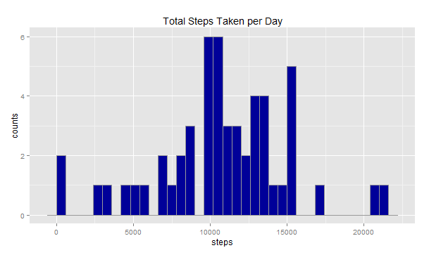
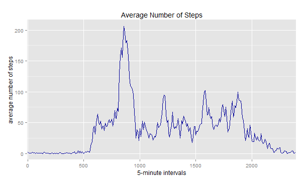
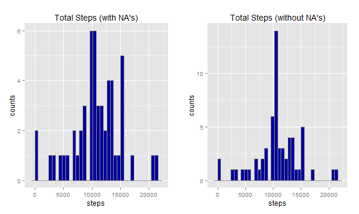
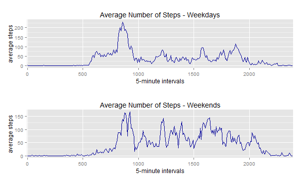

#Reproducible Research: Peer Assessment 1
==========================================
#### *Marcelo Tardelli*
#### **October 16, 2015**
        
Github repo : [https://github.com/MarceloJT/RepData_PeerAssessment1](https://github.com/MarceloJT/RepData_PeerAssessment1)


<br>
        
## About this Report
This document is the final report of the Peer Assessment 1 project from Coursera's course Reproducible Research.   
It was built up in RStudio, using its knitr functions.   
It has also been converted on a HTML file with the same name that can be found at my GitHub repository mentioned above (with link).  
All the steps followed to answer the project questions (found at the README file at the same repository) were described below in details.

<br>

## Environment Preparation
This small routine cleans up space in memory to receive the data and uploads the necessary packages for the data analysis and plotting processes.  
It also defines "echo=TRUE" as default for knitr.

```{r environmentPrep, results='hide', message=FALSE, warning=FALSE, echo=TRUE}
rm(list=ls())               # free up memory for the download of the data sets
library(knitr)
library(ggplot2)
library(gridExtra)
library(dplyr)
library(lubridate)
opts_chunk$set(echo = TRUE)
```
<br>

## Loading and Preprocessing the Data
This assignment makes use of data from a personal activity monitoring device. This device collects data at 5 minute intervals through out the day. The data consists of two months of data from an anonymous individual collected during the months of October and November, 2012 and include the number of steps taken in 5 minute intervals each day.  
The raw data was uploaded from this [link](https://d396qusza40orc.cloudfront.net/repdata%2Fdata%2Factivity.zip) and then unzipped in a folder on my computer. After that, data is read into the variable **activityData**, where dates are properly formated and the variable "interval" is set as a factor.

```{r loadingData}
activityData <- read.csv("activity.csv", header = T, 
colClasses = c("numeric", "character", "numeric"))
activityData$interval <- factor(activityData$interval)
activityData$date <- as.Date(activityData$date, format = "%Y-%m-%d")
# check the data
head(activityData)
```
  steps       date interval
1    NA 2012-10-01        0
2    NA 2012-10-01        5
3    NA 2012-10-01       10
4    NA 2012-10-01       15
5    NA 2012-10-01       20
6    NA 2012-10-01       25
```{r}
str(activityData)
```
'data.frame':	17568 obs. of  3 variables:
 $ steps   : num  NA NA NA NA NA NA NA NA NA NA ...
 $ date    : Date, format: "2012-10-01" "2012-10-01" ...
 $ interval: Factor w/ 288 levels "0","5","10","15",..: 1 2 3 4 5 6 7 8 9 10 ...
```

As observed above, the variables included in this dataset are:  
- steps: number of steps taking in a 5-minute interval (missing values are coded as NA)  
- date: date on which the measurement was taken in YYYY-MM-DD format  
- interval: identifier for the 5-minute interval in which measurement was taken.

<br>

## Assignment Questions
<br>

### What is mean total number of steps taken per day?
For this part of the assignment, **we ignore the missing values** in the dataset.  
The total number of steps taken per day is stored in the variable called "totalStepsperDay".

```{r calculateTotalSteps}
totalStepsperDay <- aggregate(steps ~ date, data = activityData, sum, na.rm = TRUE)
# check the data
head(totalStepsperDay)
```
##        date steps
##1 2012-10-02   126
##2 2012-10-03 11352
##3 2012-10-04 12116
##4 2012-10-05 13294
##5 2012-10-06 15420
##6 2012-10-07 11015
```

An histogram that summarises the data above was obtained with the follwing code:

```{r plotHistogram01}
ggplot(totalStepsperDay, aes(totalStepsperDay$steps)) + 
geom_histogram(binwidth=600,colour="#999999",fill="#000099") + 
ggtitle("Total Steps Taken per Day")+
xlab("steps")+
ylab("counts")
```


The average of the steps taken daily is :

```{r}
mean(totalStepsperDay$steps)
```
##[1] 10766.19

And the median is:

```{r}
median(totalStepsperDay$steps)
```
##[1] 10765

<br>

### What is the average daily activity pattern?
A time series plot of the 5-minute interval (x-axis) and the average number of steps taken, averaged across all days (y-axis), is obtained by:

```{r averageSteps}
averageSteps <- aggregate(steps ~ interval, data = activityData, mean, na.rm = TRUE)
colnames(averageSteps)<-c("interval01","avgSteps")
ggplot(averageSteps, aes(x = interval01, y = avgSteps, group = 1)) + 
geom_line(colour="#000099") + 
scale_x_discrete(breaks = seq(0, 2500, 500))+
ggtitle("Average Number of Steps")+
xlab("5-minute intervals")+
ylab("average number of steps")
```



The 5-minute interval, on average across all the days in the dataset, that contains the maximum number of steps is calculated as:

```{r}
averageSteps$interval01[which.max(averageSteps$avgSteps)]
```
##[1] 835

In this case, the 835-th 5-minute interval has the maximum number of steps.

<br>

### Inputing missing values
There are a significant number of days/intervals where there are missing values (coded as "NA"). The presence of missing days may introduce bias into some calculations or summaries of the data.
To verify if the occurance of such bias, we first calculate the total number of missing values in the dataset.

```{r}
sum(is.na(activityData))
```
##[1] 2304

There are 2304 NA's (missing data).

The strategy to fill in the missing values will be replacing them all by the mean of the 5-minute interval as already calculated above.  For this, we create a new table by binding "activityData" and "averageSteps", then, we replace each NA value by the respective mean for the interval, obtaining a new dataset "totalStepsNoNA".  
The code for this operation is the following:
        
        ```{r eliminateMissingData}
noNAactivityData<-cbind(activityData,averageSteps)
noNAactivityData$steps[is.na(noNAactivityData$steps)] <- noNAactivityData$avgSteps[is.na(noNAactivityData$steps)]
totalStepsNoNA<-aggregate(steps ~ date, data = noNAactivityData, sum, na.rm = TRUE)
```

The comparison between the behaviors of the data with NA's and without NA's is:
        
        ```{r plotHistogram02and03}
histogr02 <- ggplot(totalStepsperDay, aes(totalStepsperDay$steps)) + 
        geom_histogram(binwidth=600,colour="#999999",fill="#000099") + 
        ggtitle("Total Steps (with NA's)")+
        xlab("steps")+
        ylab("counts")
histogr03 <- ggplot(totalStepsNoNA, aes(totalStepsNoNA$steps)) + 
        geom_histogram(binwidth=600,colour="#999999",fill="#000099") + 
        ggtitle("Total Steps (without NA's)")+
        xlab("steps") +
        ylab("counts")
grid.arrange(histogr02, histogr03, ncol = 2)
```



The new average of the steps taken daily when NA's are removed is :

```{r}
mean(totalStepsNoNA$steps)
```
##[1] 10766.19

And the new median when NA's are removed is:
        
```{r}
median(totalStepsNoNA$steps)
```
##[1] 10766.19

Which shows no significant difference on both indicators.  However, there is a clear increase on the number of counts on the average when NA's are removed.  The distribution of the data also gets visually closer to normal.  This can be checked later in a future exercise.   

<br>

### Are there differences in activity patterns between weekdays and weekends?
To proceed with this analysis, we insert a column on "noNAactivityData", which is the dataset with the NA's properly removed (substituted by the average of the day), using the function "wday" from lubridate package. Then, subsets with the averages separated by weekends and weekdays are created and used to plot the data.

```{r dayOfTheWeek}
noNAactivityData$dayofweek<-wday(noNAactivityData$date)
noNAactivityData$dayType<-""
noNAactivityData[(noNAactivityData$dayofweek==1 | noNAactivityData$dayofweek==7),]$dayType <- "weekend"
noNAactivityData[!(noNAactivityData$dayofweek==1 | noNAactivityData$dayofweek==7),]$dayType <- "weekday"
weekdaySET <- subset(noNAactivityData,dayType=="weekday")
weekendSET <- subset(noNAactivityData,dayType=="weekend")
averageWeekDays <- aggregate(steps ~ interval, data = weekdaySET, mean, na.rm = TRUE)
averageWeekEnds <- aggregate(steps ~ interval, data = weekendSET, mean, na.rm = TRUE)
```

Plotting the graphs:
        
```{r plotLineGraphs}
gline01 <- ggplot(averageWeekDays, aes(x = interval, y = steps, group = 1)) + 
        geom_line(colour="#000099") + 
        scale_x_discrete(breaks = seq(0, 2500, 500))+
        ggtitle("Average Number of Steps - Weekdays")+
        xlab("5-minute intervals")+
        ylab("average steps")
gline02 <- ggplot(averageWeekEnds, aes(x = interval, y = steps, group = 1)) + 
        geom_line(colour="#000099") + 
        scale_x_discrete(breaks = seq(0, 2500, 500))+
        ggtitle("Average Number of Steps - Weekends")+
        xlab("5-minute intervals")+
        ylab("average steps")
grid.arrange(gline01, gline02, ncol = 1)
```



What we can observe is that there is a peak close to the 5-minute interval 835 on both weekends and weekdays sets. The main difference is that the average after that interval is much higher on the weekends, showing higher level of movement on weekends than working days.
<br>
        <br>
